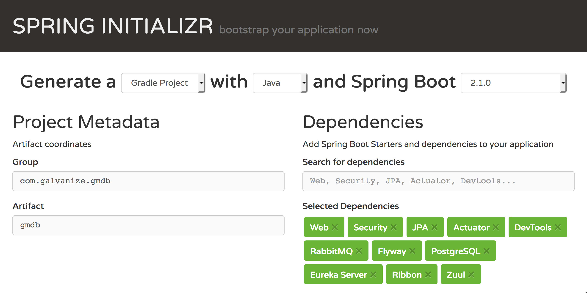

# Building a Robust Microservice Architecture

## Background

In week 2 we explored a variety of Java language features that are necessary in order to produce a robust, maintainable and functional application.

This week we'll turn our attention to building a up a Microservice Chassis that considers the various cross cutting concerns that are important to ensuring that the applications non-functional requirements are managed as well.

## The Chassis Architecture

As you can see above, the chassis in this repo contains support for the following concerns:
  * Support for restful web services. 
  * Support for Spring Security
  * Support for persistance with JPA and PostGresQL (using a relational db because Flyway doesn't work with Cassandra)
  * Support for Spring Actuator
  * Support for Asynchronous Calls using RabbitMQ
  * Support for Code Migration with Flyway
  * Support for Scalability using Eureka Name Service and Ribbon
  * Support for Gateway Security using Zuul
  
  Please be sure you have PostGresQL installed locally and that you have run `create database gmdb`
  
  ## The Specifications
  
  This application will be referenced through out the week as we explore the above tools in detail.  Please fork and clone before you begin working (as usual), commit after each passing test, and push at least once a day (or when you switch stations).
  
  The initial stories can be found in `\src\test\GMDBApplicationTests.java`.  Your initial assignment is to implement them using the best practices we discussed over the last two weeks.
